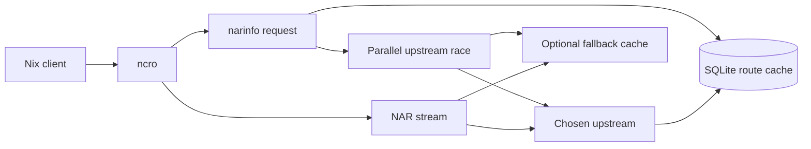
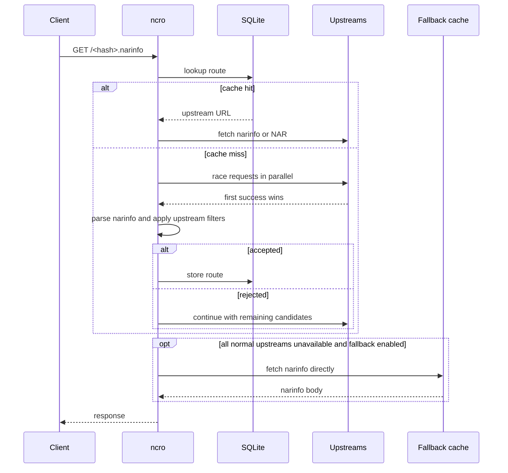
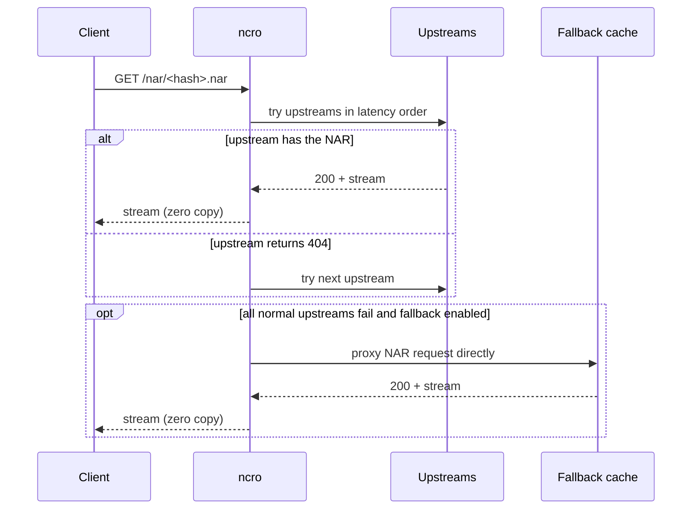
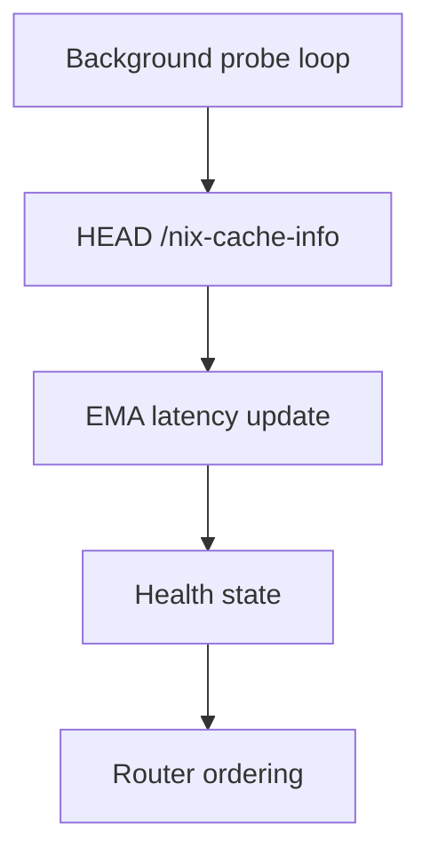
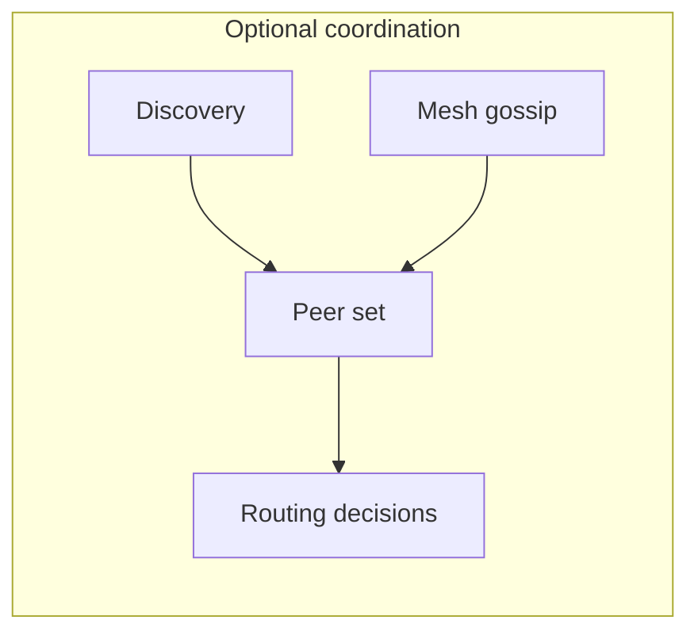

# Architecture

`ncro` is a Nix cache router. It sits in front of one or more upstream caches,
learns which upstream answers fastest for a given path, and reuses that decision
until it expires.

The routing path is simple: a narinfo lookup first checks SQLite, then falls
back to a parallel race across upstreams when there is no usable entry. The
winning upstream is stored with a TTL, so later requests can skip the race. If
all normal upstreams are unavailable, ncro can use a separately configured
fallback cache as a last resort.

Path filters sit after the narinfo fetch, not before the upstream race. A Nix
client requests `/<hash>.narinfo`, so ncro only knows the store hash at the
start of routing. The full `StorePath`, references, and deriver are inside the
narinfo body. This means filtering is a validation step for candidate winners:
if a winning upstream's narinfo is rejected, the route is not cached and ncro
retries the remaining candidates.

> [!NOTE]
> The fallback cache is deliberately outside this path. It is not an upstream in
> the router's candidate set and is not affected by filters, priority,
> discovery, cooldown, health state, or route-cache persistence. This gives
> operators a direct recovery path to a known-good cache if the normal router
> behavior or all configured upstreams are unavailable.

NAR streaming, on another hand, follows a different path. There is actually no
race and when a client requests `/nar/<hash>.nar`, ncro looks up the route for
the corresponding narinfo hash. _If_ a route exists, it opens a connection to
the winning upstream and streams the response body directly to the client
without buffering to disk. If no route exists, it tries upstreams in latency
order, falling through on 404 until one succeeds.

Background health probes keep latency estimates current by calling
`HEAD /nix-cache-info` every 30 seconds. The health layer uses Exponentially
Weighted Moving Average (EMA) smoothing, so a single bad probe does not
immediately dominate the routing decision:

$$
L_t = \alpha \cdot R_t + (1 - \alpha) \cdot L_{t-1}
$$

Where $R_t$ is the latest observed latency, $L_t$ is the new estimate, and
`alpha` (`cache.latency_alpha`, default `0.3`) controls how quickly the estimate
adapts. Higher values react faster to real changes; lower values filter out
noise.

Selection is driven by latency first. When two upstreams are effectively tied,
`priority` breaks the tie. The router also tracks failures and probe volume so
it can distinguish a briefly slow cache from one that is trending unhealthy.
Per-upstream filters can reject a candidate winner after its narinfo is fetched;
this prevents project-specific caches from becoming winners for unrelated paths.
Fallback cache traffic bypasses these router features and does not update health
or routing state.

Optional trust enforcement runs at the same acceptance point as filters. After a
candidate narinfo is fetched, ncro verifies the configured upstream signing key
when present and can record the signed narinfo as a local claim. In `signed`
mode, one valid configured signer is enough. In `quorum` mode, ncro only stores
a route after enough signer keys agree on the same `StorePath`, `NarHash`,
`NarSize`, and `References`. Rejected candidates are handled like filter
rejections: the route is not cached and ncro keeps trying remaining candidates.
When the policy is not satisfied and `trust.fail_closed = false`, the content is
served anyway but the bypass is logged and counted (`ncro_trust_bypass_total`).
The signature covers only the signed fingerprint, not the streamed NAR bytes;
the full model and that boundary are documented in [trust.md](trust.md).

> [!NOTE]
> Persistence is intentionally narrow. SQLite stores two kinds of data so a
> restart does not force ncro to relearn everything from scratch.

First type of stored data is **route entries**, a mapping from narinfo hash to
the winning upstream URL, stored with a creation timestamp and TTL. When the
cache exceeds `max_entries`, the least recently used entry is evicted first.
**Health snapshots** on another hand are per-upstream EMA latency estimates and
failure counts, refreshed by the background probe loop. **Trust claims** (when
trust is enabled) are a third kind of stored data: durable records of which
signer vouched for which content. Fallback-cache responses are (intentionally)
not stored as route entries, so normal upstreams become active again as soon as
they recover.

Negative lookups are cached in two layers: a short-lived in-memory LRU
(`in_memory_negative_ttl`) absorbs rapid-fire duplicate misses, while a
longer-lived SQLite entry (`negative_ttl`) lets a known miss survive a restart.
The in-memory layer is the only routing state that does not live in SQLite.

Discovery and mesh are optional extensions. Discovery can add peers from the
local network, while mesh gossip shares recent route decisions (and, when
`mesh.gossip_trust_claims` is enabled, re-verified trust claims) across trusted
nodes using signed UDP packets. Relayed claims are re-verified against their
original Nix signer key before being trusted, so a peer is a witness, not a
signing authority. Consider:

At runtime, ncro loads config, validates it, opens SQLite, seeds health state,
starts background loops, and finally binds the HTTP listener. The HTTP server
and all background tasks run on tokio's async runtime, allowing concurrent
upstream connections without thread-per-connection overhead. Shutdown is driven
by the normal process termination path and background work is told to stop
gracefully.
