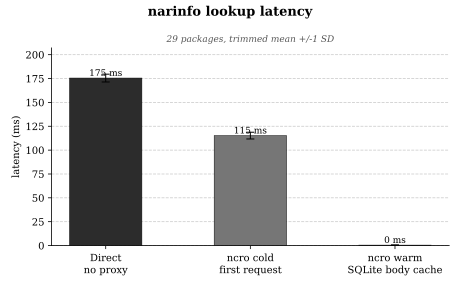

# Benchmarks

<!--markdownlint-disable MD033-->

<div align="center">
  
</div>

<!--markdownlint-enable MD033-->

ncro shines at improving narinfo lookup latency (as observed by the client). We
can benchmark the time from issuing a `GET /<hash>.narinfo` request to receiving
the complete response body. This is the latency Nix pays before it can begin
fetching the corresponding NAR, such is the case in repeated invocations of
`nix run`, `nix build`, `nix shell`, etc. For the chart above, each condition
fetches narinfo for a set of common Nix packages (resolved from the ambient
`nixpkgs` at benchmark time; 29 by default). The two ncro conditions issue one
request per package, so every sample is a genuine first lookup rather than an
in-process cache hit; the direct baseline issues several requests per package
(three by default). The top and bottom 10 % of samples are discarded before
computing the mean and standard deviation, reducing the influence of transient
upstream spikes or OS scheduler jitter.

There are three conditions:

- Direct - Client connects directly to `cache.nixos.org` over HTTPS, no proxy.
- ncro (cold) - Client connects to a local ncro instance whose SQLite route DB
  is empty. ncro must race HEAD requests to all upstreams, write the winning
  route to SQLite, then return the narinfo body.
- ncro warm - ncro is fully restarted (flushing all in-process state) with the
  same SQLite DB populated by the cold run. ncro serves the narinfo body
  directly from SQLite (`narinfo_bytes` column in the `routes` table) with no
  upstream call at all.

If you want to reproduce the benchmark yourself, the ideal path issues each
request with `curl --no-keepalive --http1.1`, which forces a fresh TCP
connection (and, for HTTPS targets, a full TLS handshake) per request. This
ensures the direct baseline pays the same connection-setup overhead that a Nix
client would on a cold path; it also means the cold and warm ncro measurements
each open a new TCP connection to the local proxy. ncro's internal `reqwest`
client may still pool its own connections to upstreams. This is intentional, as
connection pooling at the proxy boundary is part of the value ncro provides.

## Running it

The benchmark script is [`scripts/bench.py`](../scripts/bench.py). It drives a
release build of ncro and needs `nix`, `curl`, and Python with matplotlib
available. Nix can supply the Python side for a single shell rather than a
global install. Run it from the repository root:

```sh
# Build the binary the benchmark drives.
nix develop --command cargo build --release

# Run it. matplotlib is pulled in for this shell only.
nix-shell -p 'python3.withPackages(ps: [ ps.matplotlib ])' \
  --run 'python3 scripts/bench.py'
```

By default it writes `benchmark.svg` in the current directory. Pass
`--out docs/assets/benchmark.svg` to refresh the image on this page. Other flags:

- `--out FILE` - output SVG path.
- `--ncro-bin PATH` - use a specific binary instead of `target/release/ncro`.
- `--direct-rounds N` - requests per hash for the direct baseline (default 3).
- `--verbose` - print per-request timings to stderr.

> [!NOTE]
> NAR download throughput, multi-upstream routing selection under realistic
> load, mesh gossip latency, or end-to-end Nix build time. Results reflect
> narinfo-path overhead only and vary with network conditions at the time of
> measurement.

During my testing ncro was sent `SIGINT` between the cold and warm runs, and was
made to wait for clean shutdown. The warm run starts a fresh process against the
same config and DB path. This clears the `reqwest` connection pool, the
in-memory negative-TTL cache, and all other ephemeral state while preserving
only the SQLite route table. The route count is read from SQLite after the cold
run and checked to be non-zero before the warm run begins.
